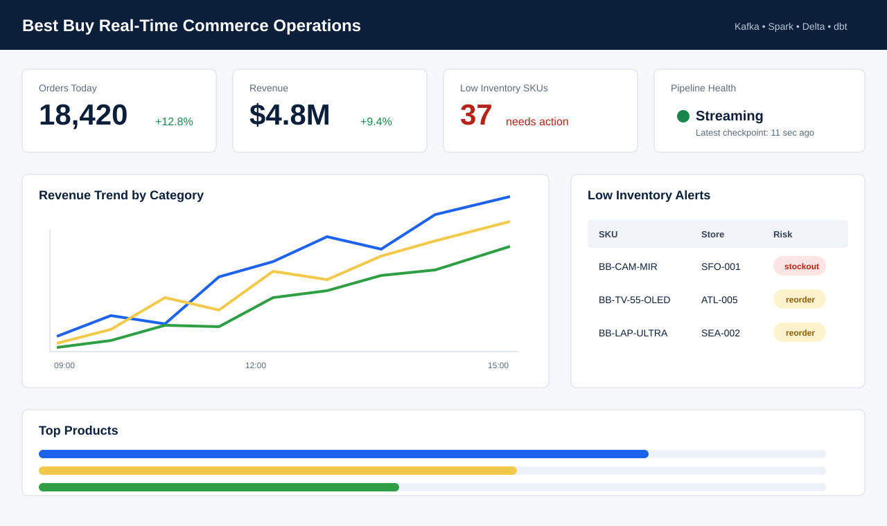
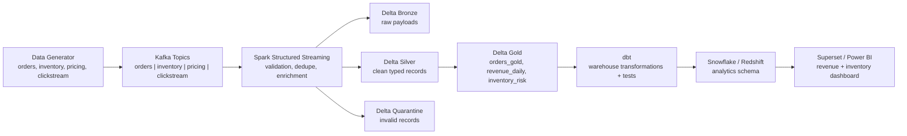

# Real-Time E-commerce Data Pipeline

Portfolio-grade streaming data platform inspired by how a retailer like Best Buy turns operational events into analytics-ready tables and dashboards.



## Problem Statement

Retail teams need near-real-time visibility into orders, revenue, product demand, and inventory risk. This project simulates orders, inventory updates, pricing changes, and clickstream events, streams them through Kafka, processes them with Spark Structured Streaming, lands them in a Delta Lakehouse, validates data quality, models business tables with dbt, and exposes dashboard-ready metrics.

## Architecture



## What Is Included

- Real-time event generator for `orders`, `inventory`, `pricing`, and `clickstream`
- Kafka topic bootstrap and producer scripts
- Spark Structured Streaming pipeline from Kafka to Delta Lake
- Bronze, Silver, Gold, and Quarantine lakehouse layout
- Data quality contracts for null checks, schema validation, duplicate detection, and late-event flags
- dbt models for `orders_gold`, `revenue_daily`, `top_products`, and `inventory_risk`
- Superset dashboard metadata plus a dashboard preview
- Pipeline health metrics for Delta commits and streaming checkpoints
- Unit tests for generator and data quality contracts

## Repository Structure

```text
bestbuy-data-platform/
├── data-generator/       # Synthetic event factory and JSONL sample generator
├── kafka-producer/       # Kafka topic creation and continuous producer
├── spark-streaming/      # Structured Streaming and Gold refresh jobs
├── data-quality/         # Contracts and reusable DQ checks
├── dbt/                  # dbt models, tests, macros, profiles example
├── dashboards/           # Superset metadata and dashboard assets
├── sample-data/          # Product catalog and generated samples
├── scripts/              # Demo and health scripts
├── tests/                # Local unit tests
├── docker-compose.yml
└── README.md
```

## Run Locally

Create a Python environment for local scripts:

```bash
python3 -m venv .venv
. .venv/bin/activate
pip install -r requirements.txt
```

Generate sample JSONL events:

```bash
python3 data-generator/generate_events.py --topic all --count 25 --out-dir sample-data/events
```

Start Kafka and Kafka UI:

```bash
docker compose up -d zookeeper kafka kafka-ui kafka-init
```

Open Kafka UI at `http://localhost:8080`.

Publish events:

```bash
python3 kafka-producer/producer.py --bootstrap-server localhost:29092 --rate-per-second 5
```

Run the streaming pipeline with Docker:

```bash
docker compose --profile stream up generator streaming-job
```

Or run with local Spark:

```bash
spark-submit \
  --packages io.delta:delta-spark_2.12:3.2.0,org.apache.spark:spark-sql-kafka-0-10_2.12:3.5.1 \
  spark-streaming/jobs/streaming_pipeline.py \
  --bootstrap-servers localhost:29092 \
  --lakehouse-root lakehouse \
  --checkpoint-root checkpoints
```

Refresh Gold tables from Silver:

```bash
spark-submit \
  --packages io.delta:delta-spark_2.12:3.2.0 \
  spark-streaming/jobs/gold_refresh.py \
  --lakehouse-root lakehouse
```

Check pipeline health:

```bash
python3 scripts/pipeline_health.py --lakehouse-root lakehouse --checkpoint-root checkpoints
```

Run tests:

```bash
python3 -m unittest discover -s tests -p "test_*.py"
python3 -m compileall data-generator kafka-producer data-quality spark-streaming scripts
```

## Sample Data Flow

1. `data-generator/events.py` creates fake but realistic commerce events.
2. `kafka-producer/producer.py` validates each event with `data-quality/schema_contracts.py`.
3. Kafka stores events by topic: `orders`, `inventory`, `pricing`, `clickstream`.
4. `spark-streaming/jobs/streaming_pipeline.py` writes raw payloads to Bronze.
5. The same streaming job parses schemas, checks required fields, flags late events, deduplicates records, and writes clean rows to Silver.
6. Invalid rows go to Quarantine for investigation.
7. Orders are enriched with the product catalog and written to Gold increments.
8. `spark-streaming/jobs/gold_refresh.py` rebuilds final Gold tables for analytics.
9. dbt models and tests prepare warehouse-friendly tables for BI tools.

## Data Quality Framework

The project checks the quality gates candidates are often expected to discuss in interviews:

- Required-field null checks by topic
- Schema validation before publish and during Spark parsing
- Duplicate detection using topic-specific dedupe keys
- Late-arriving data flags using event-time watermarks
- Quarantine tables for invalid records
- dbt tests for non-null, accepted values, and non-negative metrics

## Lakehouse Layout

```text
lakehouse/
├── bronze/
│   ├── orders/
│   ├── inventory/
│   ├── pricing/
│   └── clickstream/
├── silver/
│   ├── orders/
│   ├── inventory/
│   ├── pricing/
│   └── clickstream/
├── quarantine/
└── gold/
    ├── orders_gold/
    ├── inventory_gold/
    ├── revenue_daily/
    ├── top_products/
    └── inventory_risk/
```

## dbt Analytics Models

The dbt project includes:

- `orders_gold`: order-level fact table
- `revenue_daily`: revenue and gross margin by date, category, and channel
- `top_products`: best-selling products by revenue and units
- `inventory_risk`: latest inventory state with `healthy`, `reorder`, and `stockout` labels

`dbt/profiles.yml.example` includes local DuckDB plus Snowflake and Redshift target templates.

## Dashboard

The dashboard focuses on operations questions:

- Are orders and revenue trending up today?
- Which channels and categories are driving sales?
- Which products are at reorder or stockout risk?
- Is the streaming pipeline healthy?

Superset metadata is in `dashboards/superset/dashboard_export.json`, and the preview image is in `dashboards/assets/dashboard-preview.svg`.

## Monitoring and Logging

- Producer logs publish counts every 50 events.
- Spark checkpoints track streaming progress under `checkpoints/`.
- Delta transaction logs track table commits under each `_delta_log`.
- `scripts/pipeline_health.py` summarizes table and checkpoint health as JSON.

## Challenges and Learnings

- Event-time correctness matters more than ingestion-time convenience for operational analytics.
- A quarantine layer makes data-quality failures visible without blocking the whole stream.
- Dedupe keys must be topic-specific because clickstream, inventory, and orders have different natural keys.
- Gold tables should be easy for BI users to query, even if the streaming internals are complex.
- dbt tests complement Spark checks by validating business-ready tables after warehouse loading.
